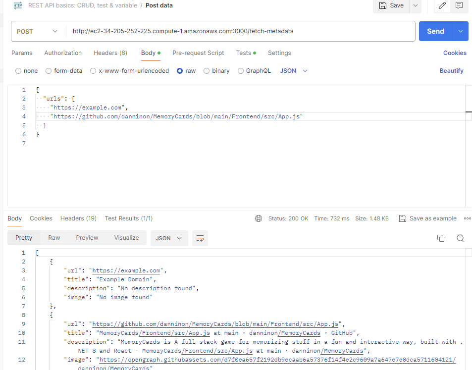

# My Fullstack Application


## Project Structure

- **Backend**: Located in the `/backend` directory.
- **Frontend**: Located in the `/frontend/my-react-application` directory.

## Setup Instructions

### Backend

1. **Navigate to the Backend Directory**:
   ```bash
   cd backend
   ```
2.  **Install Dependencies:**
   ```bash
    npm install
   ```
3. **Running the Backend:**
 To start the backend server in development mode, use:
   ```bash
   npm run dev
   ```
   
4. **Testing the Backend:**
To run the backend tests, use:
   ```bash
   npm run test
   ```
   Note: There are currently 12 tests, with one test being skipped due to issues with tests that run longer than the limit. This will be addressed in a future update.
5. **Logging:**
   The backend has a built-in logger that tracks server traffic, helping to monitor and debug application requests.

### Frontend

1. **Navigate to the React Application Directory:**
   ```bash
   cd frontend/my-react-application
   ```
   
2.  **Install Dependencies:**
   ```bash
   npm install
   ```

3. **Running The Frontend**
 To start the React application, use:
   ```bash
   npm start
   ```

4. **Testing the Frontend:**
   To run the frontend tests, use:
   ```bash
   npm run test
   ```
   Note: Currently, there are no tests written for the frontend. Testing will be added as the application evolves.

## Key Trade-Offs and Design Considerations

### Backend

1. **Test-Driven Development (TDD)**:
   - **Trade-Off**: Writing tests before or alongside the code often requires additional time and effort upfront.
   - **Why I Picked This**: I adopted TDD to ensure that the backend is robust and reliable. The git history reflects this approach, with tests added alongside the code that they cover. This approach helps in catching bugs early and ensures that the backend meets the desired use cases from the start.

2. **Separation of Concerns**:
   - **Trade-Off**: Separating logic into different layers (business logic, routing, security, and utilities) can make the codebase more complex to navigate initially.
   - **Why I Picked This**: This separation was implemented to make the backend more maintainable and scalable. By organizing code into distinct layers, it becomes easier to manage, extend, and troubleshoot. Security measures, such as protection against XSS, are isolated, making the system more secure and easier to audit.

3. **Data Models Aligned with Frontend**:
   - **Trade-Off**: Ensuring that backend data models align with frontend requirements may lead to less flexibility in data handling.
   - **Why I Picked This**: This alignment was chosen to simplify data exchange between the frontend and backend, reducing the need for complex transformations and ensuring that both layers can work seamlessly together. This decision also helps in maintaining consistency across the application.

### Frontend

1. **Modular Component Design**:
   - **Trade-Off**: Building multiple smaller components can sometimes lead to an increase in the number of files and potentially more complex state management.
   - **Why I Picked This**: The use of multiple components enhances modularity, making the codebase easier to understand, test, and maintain. It also allows for greater reusability and flexibility as the application grows, enabling components to be updated independently.

2. **Data Models Aligned with Backend**:
   - **Trade-Off**: Aligning frontend data models with the backend may reduce flexibility in how data is presented or manipulated on the frontend.
   - **Why I Picked This**: This alignment ensures that data flows smoothly between the frontend and backend without requiring significant transformations. It simplifies development and reduces the likelihood of data mismatches or errors during communication between the two layers.

3. **Structured Data Handling**:
   - **Trade-Off**: Requiring explicit structure in data handling can increase the complexity of form management and validation.
   - **Why I Picked This**: This approach was chosen to ensure that data sent to the server is consistently formatted, reducing the risk of errors and making it easier to validate inputs on both the client and server sides. This structure also makes the application more predictable and easier to debug.

### Demo Server:
1. **AWS Server Deployment**:
   - The backend server has been deployed to AWS using an EC2 instance. You can access it via the following URL:
     ```plaintext
     http://ec2-34-205-252-225.compute-1.amazonaws.com:3000
     ```

2. **Health Check Endpoint**:
   - A health check endpoint has been added to monitor the server's status. You can check the server's health by sending a request to:
     ```plaintext
     http://ec2-34-205-252-225.compute-1.amazonaws.com:3000/health
     ```

3. **HTTP Requests Only**:
   - The server is currently configured to accept only HTTP requests. HTTPS is not enabled on the server at this time.


